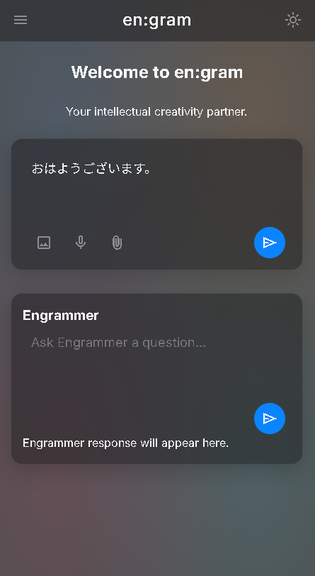
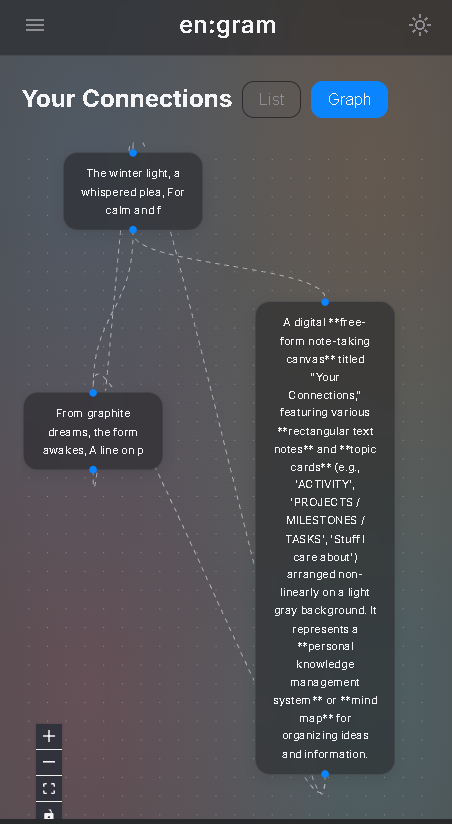
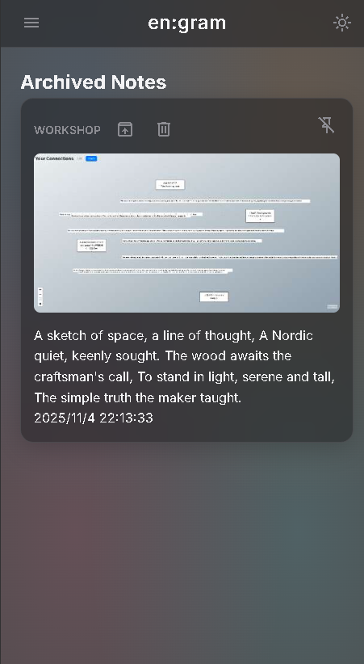
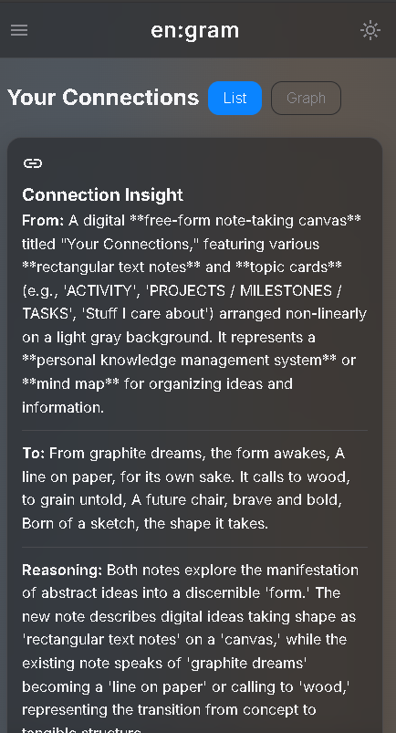

# en:gram

[](README.md) [](README_JP.md)

> **「ノイズにこそ、宇宙は宿る」**

**en:gram** は単なるメモアプリではありません。それは**セレンディピティ（予期せぬ幸運な発見）のために設計された「第二の脳」**です。生物学的な脳は効率化のために「ノイズ」を濾過（フィルタリング）してしまいますが、en:gram はその切り捨てられた「ノイズ」――あなたの思考の生々しいカオス――こそを捉え、ハイブリッドAIアーキテクチャを用いて「響き（Insight）」のシンフォニーへと変換するために作られました。



## 哲学：思考の「Gardening（庭いじり）」

従来のメモアプリは、静的な情報の「保管庫（Storage Bins）」でした。en:gram は生きた**「デジタル・ガーデン」**です。

1.  **ノイズの再起（Recall the Noise）**: 私たちは、あなたが求めている洞察（インサイト）は、あなたの脳が無意識に濾過してしまった詳細の中にこそ隠されていると信じています。en:gram は**「ノイズDB」**として機能し、すべてを高忠実度で記録する記憶の元帳となります。
2.  **検索よりもセレンディピティ（Serendipity over Search）**: あなたがメモを探すのではなく、AIがあなたを探します。AIは一見無関係に見えるアイデア同士を結びつけ、現在の思考と忘れ去られた記憶の間に「共鳴（Resonance）」を見つけ出します。
3.  **The Engrammer（エングラマー）**: あなたが眠っている間も、バックグラウンドで絶え間なく働き続ける自律型AIエージェントです。それは、あなたのナレッジグラフ（知識グラフ）を剪定し、接続し、耕し続ける**「庭師（Gardener）」**であり、「ノイズ」を意味ある「物語」へと変えていきます。

## コア機能

### 1. ハイブリッドAIマトリクス：プライバシーとパワーの両立
en:gram は、プライバシーとパフォーマンスのバランスを保つために、独自のデュアルエンジン・アーキテクチャを採用しています。

-   **オンデバイス・インテリジェンス (Gemini Nano)**:
    -   ブラウザ (Chrome) 内でローカルに動作します。
    -   **ゼロレイテンシ**、**プライバシーファースト**、**オフライン対応**。
    -   リアルタイムの提案や、プライベートな思考の処理を担当します。
-   **クラウド・コグニション (Gemini Pro/Flash via Vertex AI)**:
    -   深い推論や複雑な統合が必要な場合に、シームレスに引き継ぎます。
    -   システムはタスクの内容に応じて、最適なモデルへ自動的にルーティングします。

### 2. Engrammer Flow（エージェンティック・ワークフロー）
**LangGraph.js** を搭載した Engrammer は、ステートフル（状態を持つ）かつ非同期なエージェントです。

-   **永続性（Persistence）**: あなたの思考プロセスの文脈を、途切れることのない一本の「スレッド」として維持し続けます。
-   **自己修正（Self-Correction）**: それはただ答えるだけではなく、問いかけます。**「Human-in-the-Loop（人間参加型）」**設計を採用し、あなたのフィードバックから学び、自身のメンタルモデルを洗練させていきます。
-   **3つのループ**:
    -   **発見ループ (Discovery Loop)**: 混沌とした「ノイズDB」の中に隠された繋がりを見つけ出します。
    -   **生成ループ (Generation Loop)**: 発見された繋がりを、構造化された「スキーマ（概念）」メモへと結晶化させます。
    -   **学習ループ (Learning Loop)**: 自分自身の「盲点（アノマリーDB）」を特定し、あなた特有のコンテキストに対する理解を進化させます。

### 3. ビジュアル・ナレッジグラフ
「すりガラス（Frosted Glass）」のような美しいUIが、あなたの思考を生きた星座として描き出します。

-   **力学モデルグラフ (Force-Directed Graph)**: 意味的な類似性に基づいて、メモ同士がどのように引かれ合っているかを可視化します。
-   **インタラクティブな探索**: あなたの思考の地図（マインドマップ）を直感的に航海できます。


*ビジュアル・ナレッジグラフ：あなたの思考の星座*


*Engrammer インターフェース：第二の脳との対話*

## 技術スタック

| コンポーネント | 技術 | 役割 |
| :--- | :--- | :--- |
| **フロントエンド** | React 19, Vite, Tailwind | 「すりガラス」UIの実装 |
| **データベース** | **Dexie.js** (IndexedDB) | **ローカルファースト**なデータ所有権 |
| **AI オーケストレーション** | **LangGraph.js** | ステートフルなエージェント・ワークフロー |
| **ローカル AI** | Chrome Built-in AI (Gemini Nano) | プライバシーと速度 |
| **クラウド AI** | Firebase Functions + Vertex AI | 深い推論能力 |
| **テスト** | Vitest, Playwright | 信頼性の担保 |

## 始め方

### 前提条件
-   Node.js v20以上
-   Firebase CLI
-   Chrome Canary (Gemini Nano 機能を利用するために推奨)

### インストール
1.  **リポジトリのクローン**:
    ```bash
    git clone https://github.com/youshinh/engram.git
    cd engram
    ```
2.  **依存関係のインストール**:
    ```bash
    npm install
    ```
3.  **環境設定**:
    `.env.example` を `.env` にコピーし、Firebase の設定値を入力してください。
    ```bash
    cp .env.example .env
    ```

### 開発
ローカル開発サーバーを起動します：
```bash
npm run dev
```


*設定パネル：ハイブリッドAIの設定*

## ライセンス
MIT License - 詳細は [LICENSE](LICENSE) ファイルをご確認ください。
